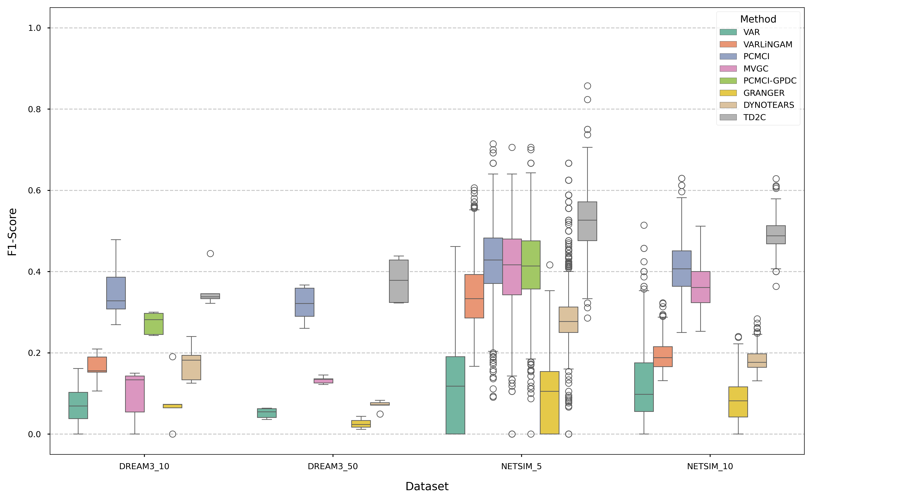

# Causal Discovery in Multivariate Time Series through Mutual Information Featurization (Preprint)

[](https://www.python.org/downloads/release/python-380/)
[](https://opensource.org/licenses/MIT)
[](https://arxiv.org/abs/2508.01848)

Slides presented at Winter School on Causality and Explainable AI are available here](https://drive.google.com/file/d/1-4gePy4eVCBhmNBjGHEsrNBkmLTasbnD/view?usp=sharing)

This repository contains the official implementation and all resources needed to reproduce the results for the paper: **["Causal Discovery in Multivariate Time Series through Mutual Information Featurization"](https://arxiv.org/abs/2508.01848)** by [Gian Marco Paldino](https://scholar.google.com/citations?user=AkTzq_8AAAAJ&hl=en) and [Gianluca Bontempi](https://gianluca.bontempi.web.ulb.be/), Machine Learning Group, ULB, Brussels.

_Note: we are currently writing instructions on how to test our trained model on *your own* time series data with python, as well as deploying it to a server where users can simply upload their time series and retrieve the estimated causal DAG. Stay tuned._

## Abstract

Discovering causal relationships in complex multivariate time series is a fundamental scientific challenge. Traditional methods often falter, either by relying on restrictive linear assumptions or on conditional independence tests that become uninformative in the presence of intricate, non-linear dynamics. This paper proposes a new paradigm, shifting from statistical testing to pattern recognition. We hypothesize that a causal link creates a persistent and learnable asymmetry in the flow of information through a system's temporal graph, even when clear conditional independencies are obscured. We introduce Temporal Dependency to Causality (TD2C), a supervised learning framework that operationalizes this hypothesis. TD2C learns to recognize these complex causal signatures from a rich set of information-theoretic and statistical descriptors. Trained exclusively on a diverse collection of synthetic time series, TD2C demonstrates remarkable zero-shot generalization to unseen dynamics and established, realistic benchmarks. Our results show that TD2C achieves state-of-the-art performance, consistently outperforming established methods, particularly in high-dimensional and non-linear settings. By reframing the discovery problem, our work provides a robust and scalable new tool for uncovering causal structures in complex systems.

## Key Highlights
- **Novel Supervised Framework**: Introduces TD2C, a new supervised learning framework for robust time series causal discovery.
- **Asymmetric Information Flow**: Models causality as a learnable, asymmetric signature in the flow of information, moving beyond simple independence tests.
- **Zero-Shot Generalization**: Generalizes from diverse synthetic data to complex benchmarks (NetSim, DREAM3) without retraining or fine-tuning.
- **State-of-the-Art Performance**: Achieves SOTA performance, showing significant advantages in high-dimensional and non-linear systems.

## Key Results

*F1-score distribution on realistic benchmark datasets. TD2C, trained only on synthetic data, consistently demonstrates strong and reliable performance in a zero-shot setting.*

---

## Repository Structure
This repository is organized to separate core source code (`src/`), reproduction scripts (`reproduce/`), data (`data/`), and generated results (`results/`).

```
.
├── reproduce/                # Scripts & notebooks to reproduce the paper's results.
│   ├── py_scripts/           # Runnable Python scripts for each pipeline step.
│   │   ├── 00_path_counting_exploration.py
│   │   ├── 01_generate_data.py
│   │   ├── 02_compute_descriptors.py
│   │   ├── 03_find_threshold.py
│   │   ├── 04_run_benchmarks.py
│   │   ├── 05_analyze_synthetic.py
│   │   ├── 06_analyze_realistic.py
│   │   ├── 07_generate_cd_diagrams.py
│   │   ├── 08_analyze_scalability.py
│   │   └── 09_analyze_features.py
│   └── notebooks/            # Jupyter notebooks for exploration and detailed commentary.
│
├── src/                      # Core source code for the TD2C framework.
│   ├── benchmark/            # Implementations of TD2C and competitor methods.
│   ├── data_generation/      # Code for generating synthetic NAR time series.
│   └── descriptors/          # Core logic for TD2C descriptor computation.
│
├── data/                     # (Must be downloaded separately) All datasets and results.
│   ├── descriptors/          # Pre-computed features for all datasets.
│   ├── observations/         # Raw generated synthetic time series data.
│   ├── causal_dfs/           # Cached final predictions from all methods.
│   ├── before_d2c/           # Cached competitor results before TD2C is added.
│   └── realistic/            # Raw benchmark data (DREAM3, NetSim).
│
├── results/                  # Generated figures and tables from the analysis scripts.
│   ├── synthetic_results/    # Analysis output for the synthetic test set.
│   ├── real_results/         # Analysis output for realistic benchmarks.
│   ├── stastistical_tests/   # CD diagrams.
│   └── ...
│
├── requirements.txt          # Python package dependencies.
└── README.md                 # This file.
```

---

## Installation and Setup


### 0. Set Up the Conda Environment
We strongly recommend using `conda` to manage dependencies.

```bash
# Create a new conda environment with Python 3.8
conda create -n td2c python=3.8 -y

# Activate the environment
conda activate td2c
```

### 1. knncmi
First, we install the knncmi package. 

```bash
git clone https://github.com/omesner/knncmi.git

cd knncmi

pip install .

cd ..
```

### 2. Clone this Repository
```bash
git clone https://github.com/gmpal/IJF-TD2C.git
cd IJF-TD2C

# Install the required packages using pip
pip install -r requirements.txt

```

### 3. Download and Set Up the Data Folder
The `data` directory, which contains all datasets, pre-computed features, and cached results, is approximately 500MB and is not stored in this Git repository. You must download it separately to reproduce the analysis without re-running the most computationally expensive steps.
Either manually:
**[>> Download the `data.zip` file here <<](https://drive.google.com/file/d/1z8cHkUTe7TlvWwqBlpoEsukWaSsvFC26/view?usp=sharing)** 
Or, using a shell: 
```bash
pip install gdown

gdown 1z8cHkUTe7TlvWwqBlpoEsukWaSsvFC26
```
Once downloaded, unzip the file and place the resulting `data` folder in the root of the repository. Either manually, or via shell:
```bash
python3 -m zipfile -e data.zip .
```

Your environment is now ready.


---

Here is a clean, professional `README.md` file designed for your project. It explains how to use the pipeline to reproduce the paper's results and details what every step does.

***

# TD2C Benchmark Reproduction Pipeline

This repository contains the code and scripts necessary to reproduce the experimental results, tables, and figures presented in the paper regarding the **TD2C (Time-Dependent Causal Discovery)** method.

The pipeline compares TD2C against state-of-the-art methods (VAR, VARLiNGAM, PCMCI, DYNOTEARS, etc.) on both synthetic datasets and realistic benchmarks (Dream3, Netsim).

## 📋 Prerequisites

### Environment Setup
Ensure you have the required dependencies installed. It is recommended to use a virtual environment (Conda or venv).

```bash
pip install numpy pandas scikit-learn imbalanced-learn matplotlib seaborn networkx
# plus the custom td2c package (ensure it is in your PYTHONPATH or installed)
```

**Note:** The scripts assume they are running from within the `experiments/` folder (or wherever you placed these files) and that the project root containing the `src/` directory is two levels up (`../../`).

### Hardware Requirements
These benchmarks are computationally intensive.
*   **Recommended:** A multi-core server (32+ cores) and at least 64GB RAM.
*   **Minimum:** A standard laptop can run the pipeline, but you **must** reduce the `--n_jobs` argument (e.g., to 4 or 8) and expect significantly longer runtimes.

---

## Reproducing the paper results 
To run the entire reproduction pipeline—from data generation to final plot creation—use the master `pipeline.py` script. This script handles memory management by executing each step as a subprocess.

```bash
cd reproduce/py_scripts
```


**Run with high parallelism (Server):**
```bash
python pipeline.py --n_jobs 50
```

**Run with low parallelism (Laptop):**
```bash
python pipeline.py --n_jobs 4
```

### Resume or Skip Steps
If you have already generated data or computed descriptors, you can skip those heavy steps to save time:

```bash
# Skip data generation and descriptor computation, start directly at threshold finding and benchmarking
python pipeline.py --n_jobs 50 --skip_data --skip_descriptors
```

---

## 📂 Pipeline Stages Description

The `pipeline.py` script orchestrates the execution of the following numbered scripts in order. You can also run them individually if needed.

| Script | Description | Output |
| :--- | :--- | :--- |
| **00.py** | **Simple Demo**<br>A minimal example showing TD2C usage on toy data. Not part of the main benchmark pipeline. | Console output |
| **01.py** | **Data Generation**<br>Generates synthetic time series data with Gaussian, Uniform, and Laplace noise distributions. | `data/observations/` |
| **02.py** | **Descriptor Computation**<br>*(Computationally Heavy)* Computes information-theoretic descriptors for all pairs of variables in Training, Testing, and Real-world datasets. | `data/descriptors/` |
| **03.py** | **Threshold Finding**<br>Uses Leave-One-Process-Out Cross-Validation to determine the optimal probability threshold for the classifier (maximizing F1-score). | Console output (Optimal Threshold) |
| **04.py** | **Main Benchmark**<br>*(Long Runtime)* Runs TD2C and all competitor algorithms (VAR, PCMCI, etc.) on all datasets. | `data/causal_dfs/` |
| **05.py** | **Test Set Analysis**<br>Calculates metrics (Precision, Recall, F1) specifically for the synthetic test data split by error type and process. | `TEST_analysis/` (Tables/Figures) |
| **06.py** | **Real Data Analysis**<br>Calculates aggregated metrics for the real-world datasets (Dream3, Netsim). | `REAL_analysis/` |
| **07.py** | **Critical Difference Plots**<br>Generates CD diagrams to statistically compare the performance of algorithms. | `CD_PLOTS/` |
| **08.py** | **Scalability Benchmark**<br>*(Optional)* Benchmarks the execution time of algorithms as the number of variables increases. | `data/benchmark_times.csv` |
| **09.py** | **Feature Importance**<br>Trains a model to analyze which descriptors are most important for causal inference across different datasets. | Console output & CSV |

---

## 📊 Results Output

After the pipeline completes, results are organized into specific directories:

*   **`data/causal_dfs/`**: Raw pickle files containing the inferred causal graphs for every method and dataset.
*   **`REAL_analysis/figures/`**: Summary boxplots comparing all methods across datasets.
*   **`TEST_analysis/figures/`**: Detailed breakdown of performance on synthetic data (by error type and process).
*   **`CD_PLOTS/`**: Statistical significance diagrams (Nemenyi/Wilcoxon tests).
*   **`POSTER_analysis/`**: High-resolution figures formatted for poster presentations.

## ⚠️ Troubleshooting

1.  **Memory Errors:**
    *   If the script crashes during Step 02 or 04, reduce `--n_jobs`.
    *   Ensure `pipeline.py` is used, as it clears Python's memory between steps.

2.  **Missing Data:**
    *   If Step 04 fails immediately, ensure Step 01 and 02 completed successfully. Check the `data/` folder for `.pkl` files.

3.  **Path Issues:**
    *   The scripts rely on `sys.path.append("../../")`. Ensure you preserve the folder structure where `src` is two levels above these scripts.

## Reproducing the Paper's Results
The `reproduce/py_scripts/` directory contains numbered Python scripts that execute the entire experimental pipeline. We recommend running them in order.

**Note:** Steps 1, 2, and 4 are computationally intensive. The provided `data` folder contains pre-computed results, allowing you to **skip these steps** and proceed directly to the analysis (Step 5 and onward) if you wish.

### Step 1: Generate Synthetic Data
Generates the synthetic training and testing datasets using the NAR processes.
*   **Output:** `data/observations/`
```bash
python reproduce/py_scripts/01_generate_data.py
```

### Step 2: Compute Descriptors
Computes the full set of TD2C descriptors for all synthetic and realistic datasets.
*   **Output:** `data/descriptors/`
```bash
python reproduce/py_scripts/02_compute_descriptors.py
```

### Step 3: Find the Optimal Threshold
Runs Leave-One-Process-Out Cross-Validation to find a robust decision threshold for TD2C.
```bash
python reproduce/py_scripts/03_find_threshold.py
```

### Step 4: Run Main Benchmarks
Trains the final TD2C classifier and runs the full benchmark against all competitor methods on all test sets.
*   **Output:** `data/causal_dfs/` and `data/before_d2c/`
```bash
python reproduce/py_scripts/04_run_benchmarks.py
```

### Step 5: Analyze Synthetic Data Results
Calculates performance metrics and generates tables/plots for the synthetic test set.
*   **Output:** `results/synthetic_results/`
```bash
python reproduce/py_scripts/05_analyze_synthetic.py
```

### Step 6: Analyze Realistic Benchmark Results
Analyzes results for NetSim and DREAM3, generating plots and tables.
*   **Output:** `results/real_results/`
```bash
python reproduce/py_scripts/06_analyze_realistic.py
```

### Step 7: Generate Statistical Test Diagrams
Performs statistical tests and generates the Critical Difference (CD) diagrams.
*   **Output:** `results/stastistical_tests/`
```bash
python reproduce/py_scripts/07_generate_cd_diagrams.py
```

### Step 8: Analyze Computational Performance
Benchmarks the runtime of all methods and generates scalability plots.
```bash
python reproduce/py_scripts/08_analyze_scalability.py
```

### Step 9: Analyze Feature Importance
Analyzes and visualizes the most important features for causal discovery.
```bash
python reproduce/py_scripts/09_analyze_features.py
```

---

## Citation
If you use this code or the TD2C framework in your research, please cite our preprint. 

```bibtex
@misc{paldino2025causal,
      title={Causal Discovery in Multivariate Time Series through Mutual Information Featurization}, 
      author={Gian Marco Paldino and Gianluca Bontempi},
      year={2025},
      eprint={2508.01848},
      archivePrefix={arXiv},
      primaryClass={cs.LG},
      url={https://arxiv.org/abs/2508.01848}, 
}
```

## License
This project is licensed under the MIT License.

## Acknowledgements
Gian Marco Paldino and Gianluca Bontempi are supported by the Service Public de Wallonie Recherche under grant nr 2010235–ARIAC by DigitalWallonia4.ai. Computational resources have been provided by the Consortium des Équipements de Calcul Intensif (CÉCI), funded by the Fonds de la Recherche Scientifique de Belgique (F.R.S.-FNRS) under Grant No. 2.5020.11 and by the Walloon Region.
